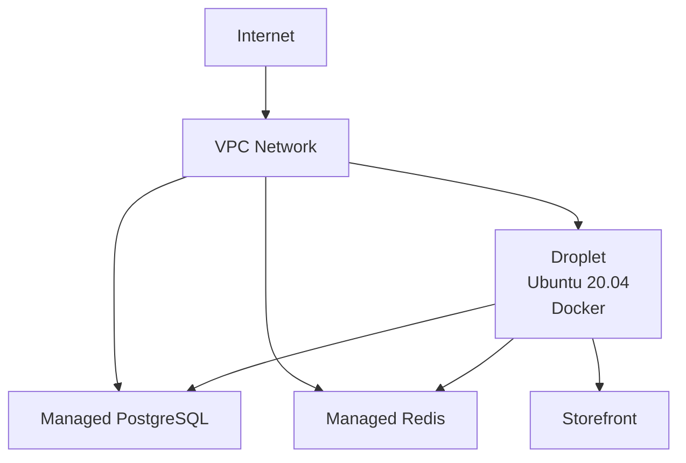

# Mattice DevOps Demo 01 - Saleor Cloud Infrastructure

This repository contains Infrastructure as Code (IaC) configurations to deploy Saleor, a modular e-commerce platform, on DigitalOcean cloud infrastructure. The project demonstrates modern DevOps practices including infrastructure provisioning with Terraform and configuration management with Ansible.

## Architecture Overview

The infrastructure consists of:

- **VPC Network**: Isolated network environment for secure communication
- **Application Server**: DigitalOcean droplet running Docker containers for:
  - Saleor API
  - Dashboard (Admin Interface)
  - Storefront
- **Managed Database**: DigitalOcean managed PostgreSQL instance
- **Managed Redis**: DigitalOcean managed Redis cluster for caching
- **Container Orchestration**: Docker Compose for service management

### Infrastructure Diagram



## Prerequisites

- DigitalOcean account with API access
- Terraform >=1.0.0
- Ansible >=2.9
- SSH key pair
- Linux/macOS environment (Windows users should use WSL2)

## Security Features

- VPC isolation for internal service communication
- Managed database with automated backups
- Environment-based configuration
- Secure secret management
- SSH key authentication

## Quick Start

1. Clone this repository:
   ```bash
   git clone https://github.com/yourusername/saleor-cloud-infrastructure.git
   cd saleor-cloud-infrastructure
   ```

2. Create a `secrets.tfvars` file:
   ```hcl
   do_token            = "your_digitalocean_api_token"
   ssh_key_fingerprint = "your_ssh_key_fingerprint"
   environment         = "staging"  # or "prod"
   ```

3. Initialize and apply Terraform configuration:
   ```bash
   cd terraform
   terraform init
   terraform plan -var-file="secrets.tfvars"
   terraform apply -var-file="secrets.tfvars"
   ```

4. Export required environment variables:
   ```bash
   export DROPLET_IP=$(terraform output -raw droplet_ip)
   export DB_HOST=$(terraform output -raw database_host)
   export REDIS_HOST=$(terraform output -raw redis_host)
   export DB_PASSWORD="your_database_password"
   export REDIS_PASSWORD="your_redis_password"
   ```

5. Run Ansible playbook:
   ```bash
   cd ../ansible
   ansible-playbook -i inventory/hosts.yml site.yml
   ```

## Infrastructure Customization

### Scaling Options

Modify `variables.tf` to adjust resource sizes:
```hcl
variable "droplet_size" {
  default = "s-2vcpu-4gb"  # Increase for higher load
}

variable "db_size" {
  default = "db-s-1vcpu-1gb"  # Adjust based on data volume
}
```

### Regional Deployment

Change the region in `variables.tf`:
```hcl
variable "region" {
  default = "nyc1"  # Available: fra1, lon1, sgp1, etc.
}
```

## Monitoring and Maintenance

- Infrastructure state is maintained in Terraform state files
- Ansible playbooks can be re-run for configuration updates
- DigitalOcean provides monitoring dashboards
- Logs available via Docker Compose

## Disaster Recovery

1. Database backups are automated via DigitalOcean
2. Infrastructure can be recreated with:
   ```bash
   terraform destroy -var-file="secrets.tfvars"
   terraform apply -var-file="secrets.tfvars"
   ```
3. Application state is restored from database backups

## Cost Optimization

Estimated monthly costs (may vary):
- Droplet (s-2vcpu-4gb): ~$20
- Database (db-s-1vcpu-1gb): ~$15
- Redis (db-s-1vcpu-1gb): ~$15
- Total: ~$50/month

## Contributing

1. Fork the repository
2. Create a feature branch
3. Commit your changes
4. Push to the branch
5. Create a Pull Request

## License

MIT License - see LICENSE file for details

## Professional Services

Need help with:
- Custom infrastructure design?
- Production deployment?
- Infrastructure audit?
- Performance optimization?

Contact: [@matthewmattice](mailto:matticem@boximity.ca)

## Project Maintainer

Matthew Mattice
- [*Founder, Boximity Inc.*](www.boximity.ca)
- GitHub: [@Boximity-Dev](https://github.com/Boximity-Dev)
- LinkedIn: [@MatthewMattice](https://www.linkedin.com/in/matthewmattice/)

---
Built with ❤️ using Terraform, Ansible, and DigitalOcean